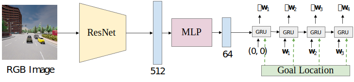

# AIM

<p align="center">  </p>

AIM consists of a ResNet34 image encoder with an autoregressive GRU-based waypoint prediction network. This is equivalent to adapting CILRS to predict waypoints conditioned on goal locations rather than predicting vehicle controls conditioned on navigational commmands.

## Training
```Shell
CUDA_VISIBLE_DEVICES=<gpu_id> python3 train.py --id aim --batch_size 192
```

## Evaluation
Update ```leaderboard/scripts/run_evaluation.sh``` to include the following.
```
export ROUTES=leaderboard/data/evaluation_routes/routes_town05_long.xml
export TEAM_AGENT=leaderboard/team_code/aim_agent.py
export TEAM_CONFIG=model_ckpt/aim
export CHECKPOINT_ENDPOINT=results/aim_result.json
export SCENARIOS=leaderboard/data/scenarios/town05_all_scenarios.json
```
