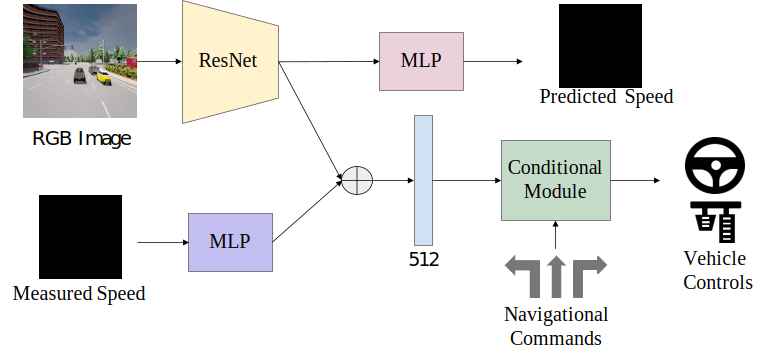

# CILRS

<p align="center">  </p>

[CILRS](https://arxiv.org/pdf/1904.08980.pdf) is a conditional imitation learning method in which the agent learns to predict vehicle controls from RGB image and measured speed while being conditioned on the navigational command. In addition, the output of the image encoder is also used for predicted the vehicle speed.

## Training
```Shell
CUDA_VISIBLE_DEVICES=<gpu_id> python3 train.py --id cilrs --batch_size 256
```

## Evaluation
Update ```leaderboard/scripts/run_evaluation.sh``` to include the following.
```
export ROUTES=leaderboard/data/evaluation_routes/routes_town05_long.xml
export TEAM_AGENT=leaderboard/team_code/cilrs_agent.py
export TEAM_CONFIG=model_ckpt/cilrs
export CHECKPOINT_ENDPOINT=results/cilrs_result.json
export SCENARIOS=leaderboard/data/scenarios/town05_all_scenarios.json
```
