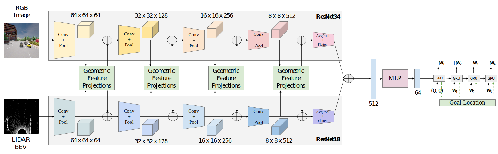

# Geometric Fusion

<p align="center">  </p>

Geometric Fusion consists of multi-scale image-to-LiDAR and LiDAR-to-image feature projections (inspired by [ContFuse](https://openaccess.thecvf.com/content_ECCV_2018/papers/Ming_Liang_Deep_Continuous_Fusion_ECCV_2018_paper.pdf)). This is equivalent to replacing the transformers in TransFuser with geometry-based feature projections.

## Training
```Shell
CUDA_VISIBLE_DEVICES=<gpu_id> python3 train.py --id geometric_fusion --batch_size 56
```

## Evaluation
Update ```leaderboard/scripts/run_evaluation.sh``` to include the following.
```
export ROUTES=leaderboard/data/evaluation_routes/routes_town05_long.xml
export TEAM_AGENT=leaderboard/team_code/geometric_fusion_agent.py
export TEAM_CONFIG=model_ckpt/geometric_fusion
export CHECKPOINT_ENDPOINT=results/geometric_fusion_result.json
export SCENARIOS=leaderboard/data/scenarios/town05_all_scenarios.json
```
