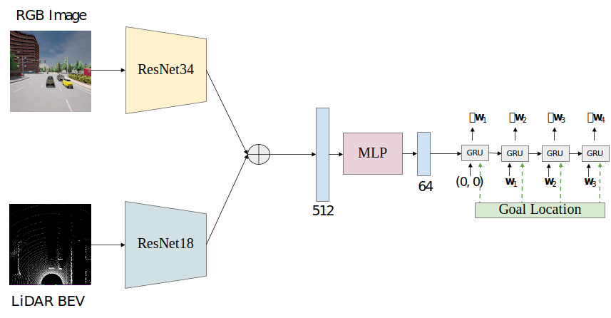

# Late Fusion

<p align="center">  </p>

Late Fusion consists of a 2-stream encoder in which the RGB image and the LiDAR BEV inputs are processed independently of each other. These features are then combined via element-wise summation and passed to waypoint prediction network. This is equivalent to removing the transformer modules from TransFuser.

## Training
```Shell
CUDA_VISIBLE_DEVICES=<gpu_id> python3 train.py --id late_fusion --batch_size 128
```

## Evaluation
Update ```leaderboard/scripts/run_evaluation.sh``` to include the following.
```
export ROUTES=leaderboard/data/evaluation_routes/routes_town05_long.xml
export TEAM_AGENT=leaderboard/team_code/late_fusion_agent.py
export TEAM_CONFIG=model_ckpt/late_fusion
export CHECKPOINT_ENDPOINT=results/late_fusion_result.json
export SCENARIOS=leaderboard/data/scenarios/town05_all_scenarios.json
