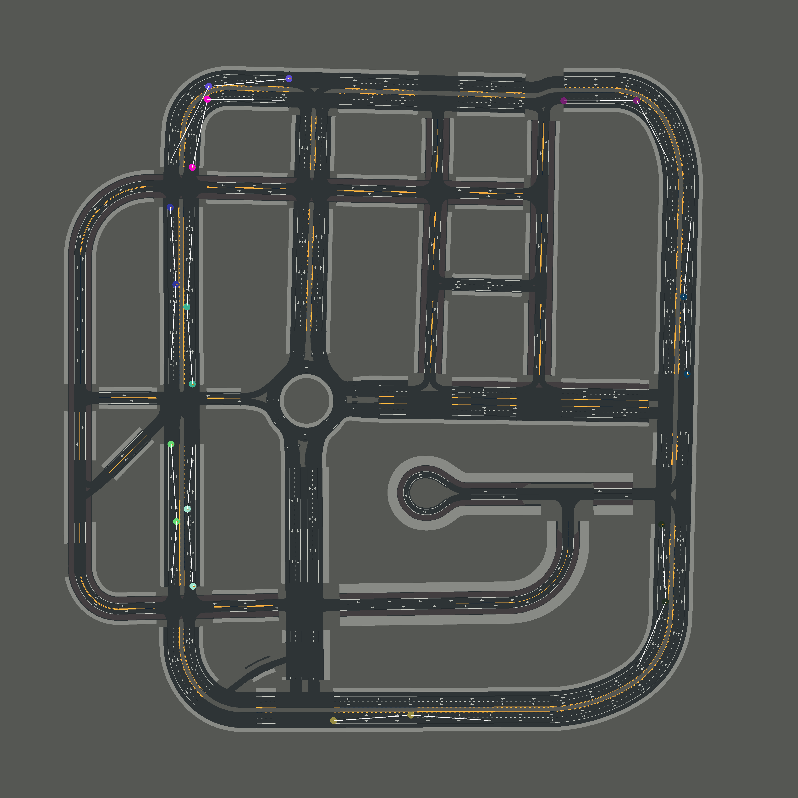
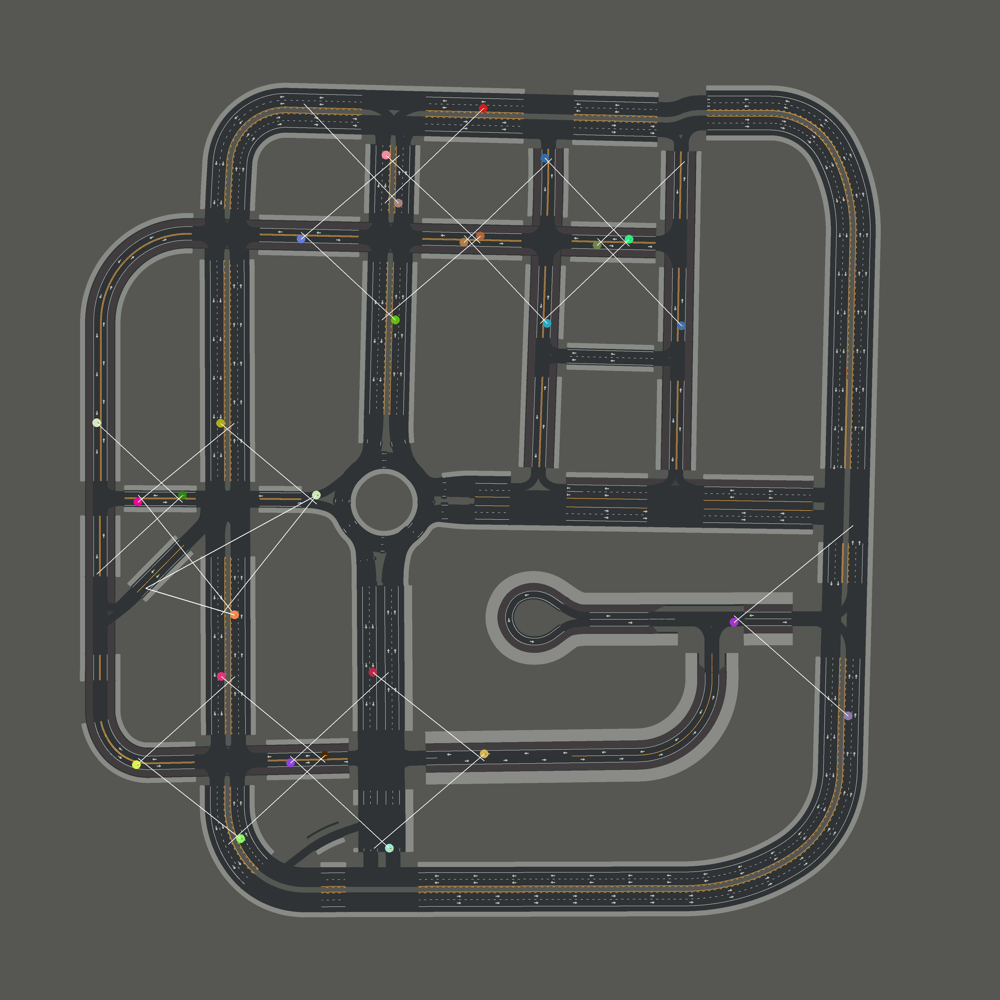

# Generating Training Scenarios and Routes

We generate around 3500 training routes in [CARLA Town01-Town07 and Town10HD](https://carla.readthedocs.io/en/latest/core_map/#carla-maps) to train our models. Each route consists of one unique scenario. A scenario is defined by a trigger 'transform' which indicates the spawn location and the orientation of that scenario in a particular town. Specifically, we consider [Scenarios 1, 3, 4, 7, 8, 9, and 10](https://leaderboard.carla.org/scenarios/) in our training dataset. 


### Pre-generated scenarios and routes
To directly use our generated routes and scenarios, please see [this folder.](../../leaderboard/data/training/) The following scripts can be edited to modify the properties of the created routes and scenarios, such as the minimum/maximum route length.


## Scenario generation
The first step of the pipeline is to generate scenario files for each town-scenario combination. The scenario generation scripts are located in the folder [gen_scenarios](./gen_scenarios/). Scenarios 4, 7, 8, 9, and 10 can only occur at intersections. We sample all the intersections present in all CARLA town maps, and extract every possible traversal through these intersections for these scenarios. Scenarios 1 and 3 can occur anywhere on a CARLA map. To generate the scenario files, you should first start a CARLA server from the root directory of your CARLA installation:
```Shell
./CarlaUE4.sh --world-port=2000 -opengl
```

There are then 4 scripts that can be run to generate json files for the 7 considered scenarios, which can be executed using: 

```Shell
./gen_scenarios/gen_scenarios.sh <carla root> <working directory of this repo (*/transfuser/)>
```


## Route generation procedure
To generate routes for the intersection-based scenarios, we check for all traversals through an intersection where the spawned scenario is valid, and include these for training. Across the 8 public town maps, we obtain around 2500 such routes through intersections. The average length of these routes is 100m. Since we have an abundance of intersections in our dataset due to the other scenarios, we collect data for Scenarios 1 and 3 along curved highways. There are around 500 such routes. The average route length is 400m, and the scenario is spawned at the middle of the route. Finally, since changing lanes is challenging, we extract curved routes similar to those with Scenarios 1 and 3, but include lane changes along the route instead of the CARLA scenario. There are around 500 lane change routes with an average length of 400m. Each such route has 2 lane changes, one at the beginning and one at the half-way point.

The code is provided in folder [gen_routes](./gen_routes/). After starting a CARLA server as described above, the route generation scripts can be executed using:

```Shell
./gen_routes/gen_routes.sh <carla root> <working directory of this repo (*/transfuser/)>
```

Note that the scenario files must already exist for generating the training routes.


## Visualization tool
The illustrations below are generated using `vis_points.py`. You can visualize a route xml or scenario json file by running:

```Shell
./vis_points.sh <carla root> <working directory of this repo (*/transfuser/)>
```

|  |  |
| -------------------------------------------------------------------- | ---------------------------------------------------------------------------------- |
| <b>Lane Changes (Town03_lr) </b>                                     | <b>Intersections (Town03_Scenario8)</b>                                            |

To visualize other routes/scenarios files, edit the args used to call `vis_points.py` in `vis_points.sh`.