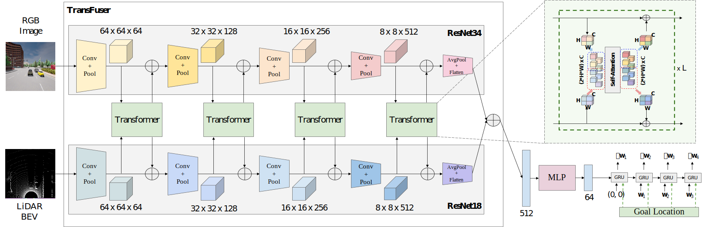

# TransFuser

<p align="center">  </p>

TransFuser uses the self-attention mechanism of the transformers for image and LiDAR feature fusion at multiple resolutions.

## Training
```Shell
CUDA_VISIBLE_DEVICES=<gpu_id> python3 train.py --id transfuser --batch_size 56
```

## Evaluation
Update ```leaderboard/scripts/run_evaluation.sh``` to include the following.
```
export ROUTES=leaderboard/data/evaluation_routes/routes_town05_long.xml
export TEAM_AGENT=leaderboard/team_code/transfuser_agent.py
export TEAM_CONFIG=model_ckpt/transfuser
export CHECKPOINT_ENDPOINT=results/transfuser_result.json
export SCENARIOS=leaderboard/data/scenarios/town05_all_scenarios.json
```
